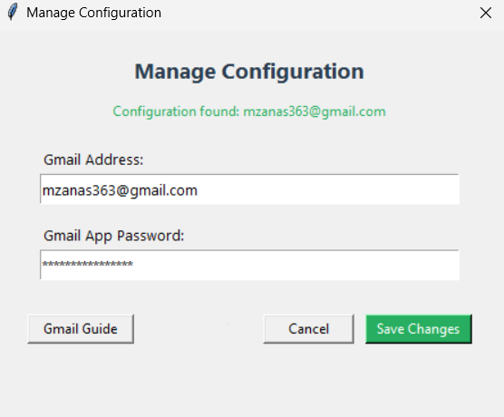
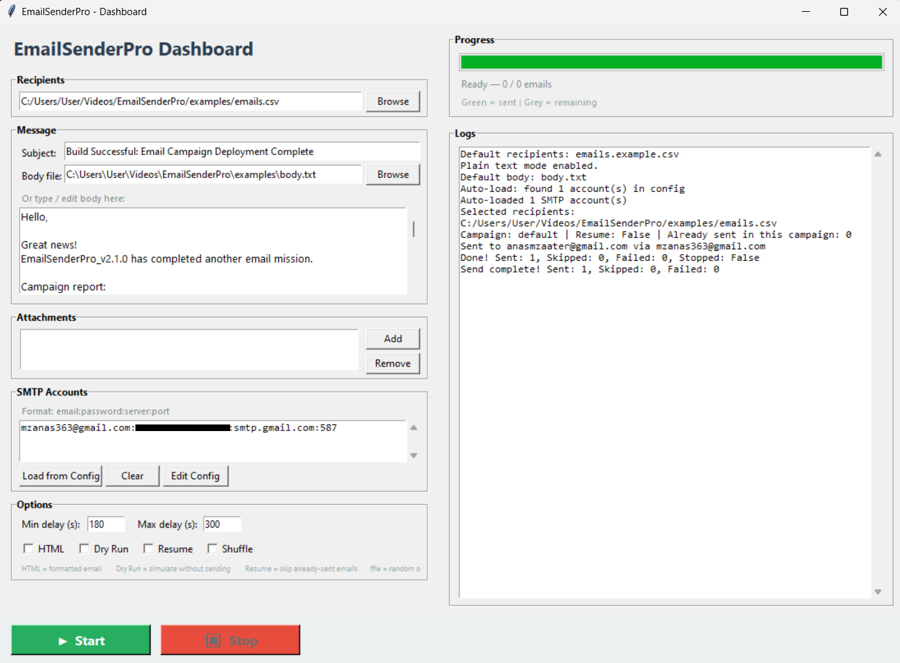
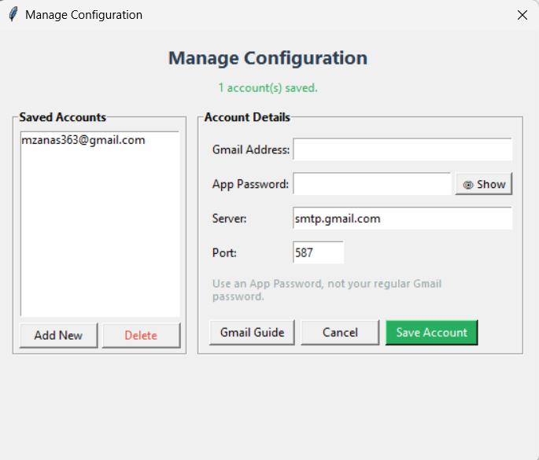
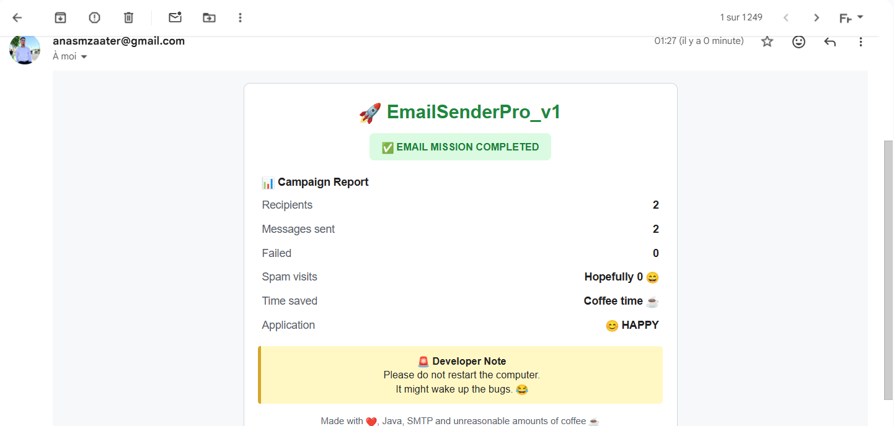
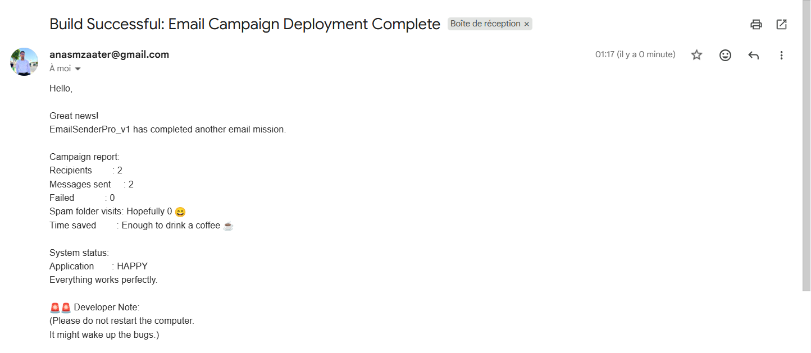
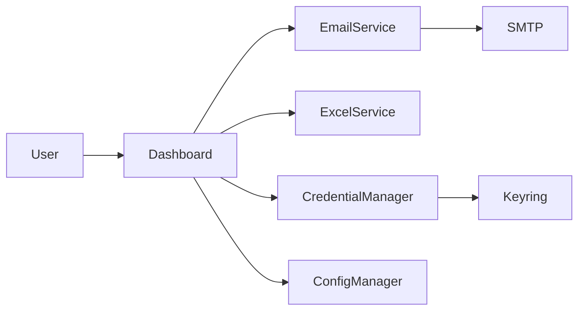

# 📧 EmailSenderPro

<p align="center">
  <strong>Professional Desktop Bulk Email Sender — Python & Tkinter</strong><br>
  Secure SMTP management • Multi-account rotation • Attachments • Smart resume • Anti-spam delays
</p>

<div align="center">

[](https://www.python.org/)
[](LICENSE)
[]()
[]()
[]()

</div>

---

## 🚀 Overview

**EmailSenderPro** is a modern desktop application for sending professional email campaigns via SMTP.

Built around simplicity and reliability, it offers:

- 🔐 Secure credential storage (System Keyring + `.env` fallback)
- 🔄 Multi-account SMTP rotation (sequential or random)
- 📊 Real-time sending progress with a progress bar
- 📎 Multiple attachment support
- 📂 CSV & Excel import (automatic `email` column detection)
- ⏱ Smart random delays to avoid spam filters
- 🧪 **Dry Run** mode to test without sending
- ▶️ Resume interrupted campaigns via `sent.json`
- 📝 HTML & plain text support with automatic format detection

Whether you're sending job applications, newsletters, customer communications, or outreach campaigns, EmailSenderPro automates the process while following email best practices.

---

## 📑 Table of Contents

- [Features](#-features)
- [Architecture](#-architecture)
- [Tech Stack](#-tech-stack)
- [Quick Start](#-quick-start)
- [Usage Guide](#-usage-guide)
- [Anti-Spam Best Practices](#️-anti-spam-best-practices)
- [Configuration](#️-configuration)
- [Project Structure](#-project-structure)
- [Troubleshooting](#-troubleshooting)
- [Development](#-development)
- [Contributing](#-contributing)
- [License](#-license)
- [Disclaimer](#-disclaimer)

---

## ✨ Features

| Feature | Description |
|---------|-------------|
| 🧙 First-Run Wizard | Guided setup to configure and validate your SMTP credentials |
| 🔐 Secure Storage | Passwords stored via the **OS System Keyring** |
| 📂 CSV Import | Load contact lists from `.csv` files |
| 📊 Excel Import | Support for `.xlsx` and `.xls` files |
| 📎 Attachments | Add multiple file attachments |
| 🔄 SMTP Rotation | **Sequential** (Round-Robin) or **Random** mode |
| ⏱ Random Delays | Variable sending intervals to mimic human behavior |
| 🧪 Dry Run | Full simulation without actually sending emails |
| ▶️ Smart Resume | Pick up where you left off thanks to `sent.json` |
| 📝 HTML Support | Plain text or HTML content with auto format detection |
| 📊 Live Logs | Real-time log console inside the UI |
| 📈 Progress Bar | Visual tracking of campaign progress |
| 🎲 Random Shuffle | Shuffle recipients for added variability |

---

## 📸 Screenshots

### 🧙 First-Run Setup

Configure your Gmail account securely during the first launch using a Gmail App Password.

<p align="center">
  
</p>

---

### 📊 Dashboard

The main workspace for managing recipients, composing emails, adding attachments, configuring campaign settings, and monitoring progress in real time.

<p align="center">
  
</p>

---

### ⚙️ SMTP Account Manager

Manage multiple SMTP accounts, securely store credentials, and switch between configurations.

<p align="center">
  
</p>

---

| HTML Campaign Result | Plain Text Campaign Result |
|---|---|
| Professional HTML notification sent after a successful campaign. | Lightweight plain-text notification for users who prefer text-only emails. |
|  |  |

---

## 🏗 Architecture



---

## 🛠 Tech Stack

| Technology | Purpose |
|------------|---------|
| Python 3.10+ | Core language |
| Tkinter | Desktop GUI |
| Pandas | CSV / Excel parsing |
| OpenPyXL | Excel file support |
| Keyring | Secure password storage |
| python-dotenv | Secret storage fallback |
| Threading | Background sending (non-blocking) |
| smtplib | Email delivery via SMTP |

---

## ⚡ Quick Start

### Prerequisites

- Python **3.10+**
- A Gmail account with **2-Factor Authentication (2FA)** enabled
- A Gmail **App Password** (not your regular password)

> 🔑 [How to create a Gmail App Password](https://support.google.com/accounts/answer/185833)

### Installation

```bash
# 1. Clone the repository
git clone https://github.com/Anas-MZAATER/EmailSenderPro.git
cd EmailSenderPro

# 2. Create a virtual environment (recommended)
python -m venv venv

# Windows:
venv\Scripts\activate

# macOS / Linux:
source venv/bin/activate

# 3. Install dependencies
pip install -r requirements.txt
```

### Running the App

```bash
# Method 1: via the launcher
python run.py

# Method 2: as a module
python -m emailsenderpro

# Method 3: direct entry point
python src/emailsenderpro/app.py
```

- **First launch:** The setup wizard will ask for your Gmail credentials and validate them live.
- **Subsequent launches:** The dashboard opens directly with your account pre-loaded.

---

## 🛠️ Usage Guide

### 1. Prepare Your Recipient List

Create a CSV or Excel file with at least one column named `email`:

```csv
email
john.doe@example.com
jane.smith@company.com
contact@startup.io
```

### 2. Prepare Your Message

Write your email body in a `.txt` file (plain text) or `.html` file (formatted). The app automatically detects the format from the file extension.

### 3. Configure SMTP Accounts

You can add multiple accounts in the dashboard using this format:

```
email:password:server:port
```

**Gmail example:**
```
example@gmail.com:abcd efgh ijkl mnop:smtp.gmail.com:587
```

**Outlook example:**
```
contact@company.com:mypassword:smtp.office365.com:587
```

> 💡 The account configured via the Setup Wizard is automatically pre-loaded in the dashboard.

### 4. Send Emails

1. Select your contact file
2. Enter the email subject
3. Load or type your message body
4. Add attachments (optional)
5. Adjust delays if needed
6. Click **Start**

> 💡 **Pro tip:** Always run a **Dry Run** first to verify everything works without sending real emails.

---

## 🛡️ Anti-Spam Best Practices

To maximize deliverability and avoid the spam folder, follow these rules:

### 1. Warm Up Your Account

| Day | Max Emails | Delay Range |
|-----|-----------|-------------|
| 1-3 | 10-20 | 300-600s |
| 4-7 | 30-50 | 180-300s |
| 8-14 | 80-100 | 120-240s |
| 15+ | 150-200 | 60-180s |

> ⚠️ Never send hundreds of emails on day one with a fresh Gmail account. Google will flag you immediately.

### 2. Avoid Spam Trigger Words

**Words to Avoid (Spam Triggers):**
```
FREE, URGENT, ACT NOW, LIMITED TIME, CONGRATULATIONS,
WINNER, CASH, $$$, 100% FREE, CLICK HERE, BUY NOW,
MAKE MONEY, NO OBLIGATION, RISK FREE, ACT IMMEDIATELY
```

**Recommended Alternatives:**
```
Invitation, Update, Information, Regarding, Opportunity,
Collaboration, Follow-up, Introduction, Proposal
```

### 3. Technical Checklist

- [ ] **SPF record** configured on your domain
- [ ] **DKIM signing** enabled (Gmail does this automatically)
- [ ] **DMARC policy** set up
- [ ] **Custom domain** preferred over `@gmail.com` for bulk sending
- [ ] **Reply-to address** is valid and monitored
- [ ] **Unsubscribe link** included (legally required in many countries)

### 4. Content Tips

- **Balance text and images** — avoid image-only emails
- **Use a real sender name** — e.g. `John Doe <john@company.com>`
- **Personalize** the subject and greeting with the recipient's first name
- **Keep it short** — 50 to 125 words is the sweet spot
- **One clear CTA** — don't ask for multiple actions at once
- **Test with [Mail-Tester](https://www.mail-tester.com/)** before bulk sending

### 5. List Hygiene

- Only send to **opt-in** recipients
- Remove **bounced** emails immediately
- Remove **unsubscribed** users immediately
- Never buy email lists
- Validate emails with a verification tool before sending

### 6. Recommended In-App Settings

| Setting | Anti-Spam Value | Why |
|---------|----------------|-----|
| Min delay | 180s (3 min) | Mimics human behavior |
| Max delay | 600s (10 min) | Randomization confuses filters |
| Rotation mode | Random | Distributes load across accounts |
| HTML content | Off (if possible) | Plain text has better deliverability |
| Dry Run | Always first | Verify before real sending |

---

## ⚙️ Configuration

### Where is my data stored?

| File | Location | Content |
|------|----------|---------|
| `config.json` | `~/.email_sender_pro/` | Email address, preferences |
| System Keyring | OS Credential Store | App password (secure) |
| `.env` (fallback) | `~/.email_sender_pro/` | App password (if keyring unavailable) |
| `sent.json` | Project root | History of already sent emails |
| `app.log` | Project root | Detailed application logs |

---

## 📂 Project Structure

```
EmailSenderPro/
│
├── examples/
│   ├── emails.example.csv       # Sample contact list
│   ├── emails.csv               # Your contact list
│   ├── body.txt                 # Sample plain text message
│   └── body.html                # Sample HTML message
│
├── src/
│   └── emailsenderpro/
│       ├── __init__.py
│       ├── __main__.py
│       ├── app.py               # Main entry point
│       ├── dashboard.py         # GUI (Tkinter)
│       ├── setup_wizard.py      # First-run configuration wizard
│       │
│       ├── core/
│       │   ├── config_manager.py      # Configuration management (JSON)
│       │   ├── credential_manager.py  # Secure credential storage
│       │   ├── smtp_validator.py     # SMTP credential validation
│       │   └── email_service.py      # Multi-account sending service
│       │
│       ├── services/
│       │   └── excel_service.py      # CSV / Excel loader
│       │
│       └── utils/
│           └── logger.py             # Centralized logging setup
│
├── run.py                       # Launcher with PYTHONPATH setup
├── requirements.txt             # Python dependencies
├── sent.json                    # Send history (resume)
├── app.log                      # Log file
├── LICENSE                      # MIT License
└── README.md                    # This file
```

---

## 🐛 Troubleshooting

| Problem | Solution |
|---------|----------|
| `ModuleNotFoundError` | Run `pip install -r requirements.txt` |
| SMTP authentication error | Use a **Gmail App Password**, not your regular password. Enable 2FA first. |
| Keyring not available | Install `pip install keyring` or the app will fallback to `.env` file |
| Emails go to spam | Follow the **Anti-Spam Best Practices** section above. Increase delays, avoid spammy words, warm up your account gradually. |
| App will not start | Make sure you are in the project folder and use `python run.py` |
| Account suspended by Gmail | You sent too many emails too fast. Wait 24 hours, reduce volume, increase delays. |

---

## 🧪 Development

```bash
# Run the app
python run.py

# Run as a module
python -m emailsenderpro
```

> 💡 `Makefile`, unit tests, and PyInstaller builder are planned for future versions.

---

## 🤝 Contributing

Contributions, feature requests, and bug reports are welcome.
If you'd like to improve the project, feel free to open an issue or submit a pull request.

1. Fork the project
2. Create a feature branch (`git checkout -b feature/my-feature`)
3. Commit your changes (`git commit -m 'Add my feature'`)
4. Push to the branch (`git push origin feature/my-feature`)
5. Open a Pull Request

---

## 📄 License

This project is licensed under the **MIT License** — see the [LICENSE](LICENSE) file for details.

---

## 🙏 Acknowledgments

- Built with [Python](https://www.python.org/) & [Tkinter](https://docs.python.org/3/library/tkinter.html)
- Secure storage via [keyring](https://github.com/jaraco/keyring)
- Data handling with [pandas](https://pandas.pydata.org/)

---

## ⚠️ Disclaimer

**EmailSenderPro** is intended for legal and ethical use: legitimate email campaigns, job applications, customer communications, newsletters, and B2B outreach. Always comply with anti-spam laws (CAN-SPAM, GDPR, etc.) and respect recipient privacy. The authors are not responsible for misuse of this software.

---

<p align="center">
  <b>Built with ❤️ by Anas Mzaater</b><br>
  <a href="https://github.com/Anas-MZAATER">GitHub</a> • 
  <a href="https://www.linkedin.com/in/anas-m-0b74821aa/">LinkedIn</a>
</p>
